> This repository is a vibe-coding-corrected fork that has been cleaned up for real Codex-first use.
> Original project: [SethGammon/Citadel](https://github.com/SethGammon/Citadel)

<div align="center">

[](LICENSE)
[](https://nodejs.org/)
[](https://openai.com/codex/)
[](https://sethgammon.github.io/Citadel/)

*Stop re-explaining your codebase every session. Start compounding what your agents learn.*

</div>

## What Is Citadel

A Codex-native orchestration harness. It coordinates multiple AI agents in parallel, persists memory across sessions, and projects Citadel guidance, skills, agents, and hooks into a Codex-first workspace.

## Why Citadel Exists

**Without Citadel**, every Codex session starts from zero. You re-explain architecture decisions. You re-discover that the auth module is fragile. You copy-paste the same review checklist. When a task is too big for one agent, you manually split it and lose context between the pieces. Your agents never get better at your codebase — you just get better at prompting them.

**With Citadel**, sessions resume where they left off. A `/do review` runs a structured 5-pass review that remembers what broke last time. A `/do overhaul the API layer` spawns parallel agents in isolated worktrees, shares discoveries between them, and merges the results. Skills you build once compound across every future session. The system learns from its own mistakes through campaign persistence and telemetry.

The difference: `AGENTS.md` tells Codex about your project. Citadel gives Codex the *infrastructure to work autonomously* — routing, memory, safety hooks, and coordination that a single guidance file can't provide.

## Quickstart

**Prerequisites:** Codex + [Node.js 18+](https://nodejs.org/)

```bash
# 1. Clone Citadel
git clone https://github.com/SethGammon/Citadel.git

# 2. Project the Codex runtime artefacts into your workspace
cd /path/to/project
node /path/to/Citadel/scripts/setup-codex.js --mode full
# 3. Open the project in Codex and use the projected guidance
codex
```

[Full install guide with alternative methods](QUICKSTART.md)

## How It Works

Say what you want. `/do` routes it to the cheapest tool that can handle it.

```
/do fix the typo on line 42        # Direct edit, no model call
/do review the auth module         # 5-pass structured code review
/do why is the API returning 500   # Root cause analysis
/do build a caching layer          # Multi-step orchestrated build
/do overhaul all three services    # Parallel fleet with isolated worktrees
```

Classification runs across four tiers, each cheaper than the last:

1. **Pattern match** — catches trivial commands with regex. Zero tokens, zero model calls, instant.
2. **Session state** — checks if you're mid-campaign and resumes it. Still zero tokens.
3. **Keyword lookup** — scans your input against installed skill keywords ("review", "test", "refactor") and routes directly. Still zero tokens.
4. **LLM classification** — only when tiers 1-3 don't match, a structured complexity analysis (~500 tokens) determines whether you need a single-step Marshal, a multi-session Archon, or a parallel Fleet.

Most requests resolve at tiers 1-3 for free. Tier 4 is the exception, not the default. You never have to choose the tool.

**[See it route live](https://sethgammon.github.io/Citadel/)**

## The Orchestration Ladder

Four tiers. Use the cheapest one that fits.

<table>
<tr>
<td width="50%">

</td>
<td width="50%">

</td>
</tr>
<tr>
<td width="50%">

</td>
<td width="50%">

</td>
</tr>
</table>

## What You Get

**Cost transparency.** Citadel records session telemetry directly in project state. Historical Claude session files can still be read as a legacy compatibility source, but Codex stays functional without them.

**Safety hooks.** Citadel projects the supported hook surface into `.codex/hooks.json`. A consent system gates external actions (pushes, PRs, comments) with first-encounter choice — always-ask, session-allow, or auto-allow. Protected branches can't be deleted. Path traversal and secrets exfiltration are blocked. A circuit breaker stops failure spirals before they burn tokens.

**Campaign persistence.** Multi-session work survives context compression and session boundaries. Start an architecture overhaul today, close your laptop, pick it up tomorrow — the campaign state, decisions, and progress are all preserved. `/do continue` resumes exactly where you left off.

**Parallel coordination.** Fleet mode spawns multiple agents in isolated git worktrees, shares discoveries between them in real time, and merges results. One command, multiple agents, no conflicts.

## FAQ

**Is this for me?** If you're running Codex on a real codebase and finding that agents lose context, repeat mistakes, or can't work in parallel, yes.

**How is this different from AGENTS.md?** `AGENTS.md` tells Codex about your project. Citadel tells Codex *how to work*: durable state, intelligent routing, automated safety, and native parallelism.

**Do I need to learn all 40 skills?** No. Just use `/do` and describe what you want in plain English. The router picks the right skill. You can go months without ever typing a skill name directly.

**What if `/do` routes to the wrong tool?** Tell it. "Wrong tool" or "just do it yourself" and it adjusts. You can also invoke any skill directly: `/review`, `/archon`, etc. The router is a convenience, not a gate.

**How much does it cost in tokens?** Citadel adds ~2.5% overhead to your session cost. Skills cost zero when not loaded. The `/do` router costs ~500 tokens only at Tier 4. Use `/cost` to see real token data and exact spend for any session or campaign.

**How is this different from CrewAI, LangChain, or Aider?** Those are agent frameworks: they give you primitives for building agents from scratch. Citadel is an *operating system for an existing agent runtime*.

**Does this work on Windows?** Yes. All hooks and scripts run on Node.js. The Codex-first setup flow is file-based and cross-platform.

## Learn More

- [**Interactive routing demo**](https://sethgammon.github.io/Citadel/) — type any task, watch the tier cascade animate
- [Full install guide](QUICKSTART.md) — Codex setup, projected artefacts, and troubleshooting
- [Skills reference](docs/SKILLS.md) — all 40 skills with invocation and examples
- [Hooks reference](docs/HOOKS.md) — 15 event types, what each one enforces
- [Campaign guide](docs/CAMPAIGNS.md) — persistent state, phases, AI amnesia prevention
- [Fleet guide](docs/FLEET.md) — parallel agents, worktree isolation, discovery relay
- [Security model](SECURITY.md) — path traversal, shell injection, and defensive measures
- [Contributing](CONTRIBUTING.md) — how to submit issues, PRs, and new skills
- [External overview](https://repo-explainer.com/SethGammon/Citadel/) — third-party writeup on the architecture and philosophy


## Community & Growth

Citadel is growing fast in the AI engineering community. Here's how to get involved:

### GitHub Stars
If Citadel is useful to you, a star is the easiest way to show support:

[](https://github.com/SethGammon/Citadel)

### Roadmap

The project is actively developed. Key areas on the roadmap:

- [x] Codex-native runtime
- [x] Fleet mode with worktree isolation
- [x] Campaign persistence across sessions
- [x] Desktop app for campaign management
- [ ] Governance layer (per-agent policies, immutable audit log)
- [ ] Campaign recovery and rollback
- [ ] Web dashboard (Citadel Cloud)
- [ ] Team collaboration features

### Contributing

Contributions are welcome! See [CONTRIBUTING.md](CONTRIBUTING.md) for how to:
- Submit issues with bug reports or feature requests
- Create pull requests for skills, hooks, or docs
- Share your use cases and workflows

### Share Your Setup

Built something interesting with Citadel? Open an Issue to share your workflow — good setups get featured here.

---

## License

MIT
